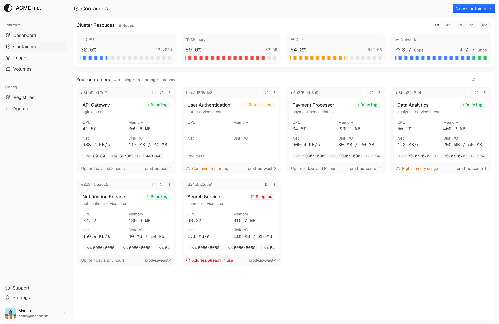

_Monitoring and managing containers with the Containers UI._

# containers

Platform to monitor and manage OCI-compliant containers with a modern UI and a lightweight backend.

## Architecture

- `apps/api`: Hono-based API server. Talks to the Docker socket and exposes container, image, and file operations.
- `apps/web`: Next.js frontend for the platform.
- `packages/shared`: Shared schemas and types used by API and Web.

## Requirements

- Bun >= 1.3.0
- Docker (Buildx enabled) and Docker Compose
- PostgreSQL (via `docker-compose.yaml` or external)

## Quick start (Docker Compose)

1. Create env files:

- `apps/api/.env.prod`
- `apps/web/.env.prod`

2. (Optional) set `NEXT_PUBLIC_API_URL` for the web build.

- Via shell:

```sh
export NEXT_PUBLIC_API_URL=http://localhost:9999
```

- Or create a root `.env` file:

```env
NEXT_PUBLIC_API_URL=http://localhost:9999
```

3. Build and run:

```sh
NEXT_PUBLIC_API_URL=${NEXT_PUBLIC_API_URL:-http://localhost:9999} docker compose up -d --build
```

Web UI: http://localhost:3000  
API: http://localhost:9999

## Manual run (build and run containers separately)

### API

Build:

```sh
docker buildx build -f apps/api/Dockerfile -t api --load .
```

Run:

```sh
docker run \
  --env-file apps/api/.env.prod \
  -p 9999:9999 \
  -v /var/run/docker.sock:/var/run/docker.sock \
  --name api \
  api
```

### Web

Build:

```sh
docker buildx build -f apps/web/Dockerfile --build-arg NEXT_PUBLIC_API_URL=http://localhost:9999 -t web --load .
# Replace with the public URL where the API is reachable from the web container.
```

Run:

```sh
docker run \
  --env-file apps/web/.env.prod \
  -p 3000:3000 \
  --name web \
  web
```

## Environment variables

### API (`apps/api/.env.prod`)

- `NODE_ENV` (default: `development`)
- `PORT` (default: `8080`)
- `LOG_LEVEL` (`trace|debug|info|warn|error|fatal`, default: `info`)
- `APP_URL`
- `UPLOAD_DIR`
- `DATABASE_URL`
- `EMAIL_FROM`
- `SMTP_HOST`
- `SMTP_PORT`
- `SMTP_SECURE` (`true|false`)
- `SMTP_USERNAME`
- `SMTP_PASSWORD`
- `AUTH_CROSS_SUBDOMAIN_COOKIES_ENABLED` (`true|false`, default: `false`)
- `AUTH_CROSS_SUBDOMAIN_COOKIES_DOMAIN` (required when enabled; must start with a dot, e.g. `.example.com`)

### Web (`apps/web/.env.prod`)

- `NODE_ENV` (default: `development`)
- `NEXT_PUBLIC_API_URL`

Note: `NEXT_PUBLIC_API_URL` is baked into the Next.js bundle at build time. When using Docker, pass it as a build arg or set it before `docker compose up -d --build`. It must be reachable from the browser (outside the Compose network), e.g. `http://localhost:9999`.

### Auth cross-subdomain cookies

To share auth cookies across subdomains (e.g. `app.example.com` and `api.example.com`), set:

```
AUTH_CROSS_SUBDOMAIN_COOKIES_ENABLED=true
AUTH_CROSS_SUBDOMAIN_COOKIES_DOMAIN=.example.com
```

If disabled, no cross-subdomain cookie configuration is applied. When enabled, the domain must be a bare domain (no protocol) and start with a dot.

## Local development (no Docker)

Install dependencies:

```sh
bun install
```

Run all apps:

```sh
bun run dev
```

## Database migrations

Run Drizzle migrations from the API workspace:

```sh
cd apps/api
bunx drizzle-kit migrate
```

## Scripts

- `bun run build`: build all workspaces
- `bun run dev`: run all dev servers
- `bun run check`: run Ultracite checks
- `bun run fix`: auto-fix formatting and lint issues

## Contributing

Issues and PRs are welcome. Keep changes focused and add context in the description. Run `bun run check` before submitting.

## License

Apache-2.0. See `LICENSE`.
