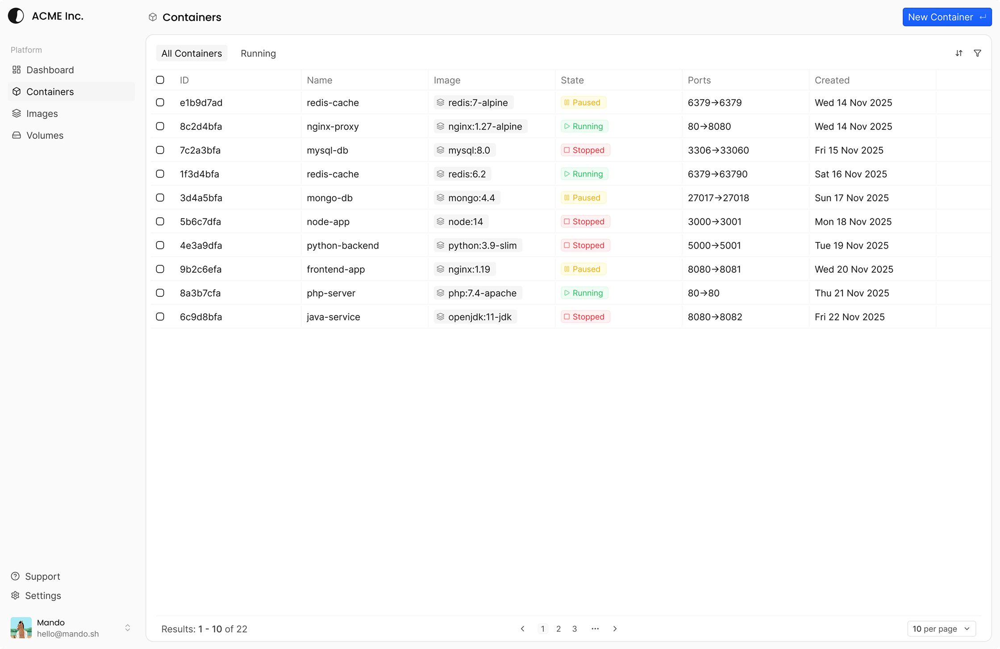

# containers

Platform to monitor and manage OCI-compliant containers with a modern UI and a lightweight backend.

## Architecture

- `apps/api`: Hono-based API server. Talks to the Docker socket and exposes container, image, and file operations.
- `apps/web`: Next.js frontend for the platform.
- `packages/shared`: Shared schemas and types used by API and Web.

## Requirements

- Bun >= 1.3.0
- Docker (Buildx enabled) and Docker Compose
- PostgreSQL (via `docker-compose.yaml` or external)

## Quick start (Docker Compose)

1. Build images:

```sh
docker buildx build -f apps/api/Dockerfile -t api --load .
docker buildx build -f apps/web/Dockerfile --build-arg NEXT_PUBLIC_API_URL=http://localhost:9999 -t web --load .
# Replace with the public URL where the API is reachable from the web container.
```

2. Create env files:

- `apps/api/.env.prod`
- `apps/web/.env.prod`

3. Run:

```sh
docker compose up -d
```

Web UI: http://localhost:3000  
API: http://localhost:9999

## Manual run (build and run containers separately)

### API

Build:

```sh
docker buildx build -f apps/api/Dockerfile -t api --load .
```

Run:

```sh
docker run \
  --env-file apps/api/.env.prod \
  -p 9999:80 \
  -v /var/run/docker.sock:/var/run/docker.sock \
  --name api \
  api
```

### Web

Build:

```sh
docker buildx build -f apps/web/Dockerfile --build-arg NEXT_PUBLIC_API_URL=http://localhost:9999 -t web --load .
# Replace with the public URL where the API is reachable from the web container.
```

Run:

```sh
docker run \
  --env-file apps/web/.env.prod \
  -p 3000:3000 \
  --name web \
  web
```

## Environment variables

### API (`apps/api/.env.prod`)

- `NODE_ENV` (default: `development`)
- `PORT` (default: `8080`)
- `LOG_LEVEL` (`trace|debug|info|warn|error|fatal`, default: `info`)
- `APP_URL`
- `UPLOAD_DIR`
- `DATABASE_URL`
- `EMAIL_FROM`
- `SMTP_HOST`
- `SMTP_PORT`
- `SMTP_SECURE` (`true|false`)
- `SMTP_USERNAME`
- `SMTP_PASSWORD`

### Web (`apps/web/.env.prod`)

- `NODE_ENV` (default: `development`)
- `NEXT_PUBLIC_API_URL`

## Local development (no Docker)

Install dependencies:

```sh
bun install
```

Run all apps:

```sh
bun run dev
```

## Database migrations

Run Drizzle migrations from the API workspace:

```sh
cd apps/api
bunx drizzle-kit migrate
```

## Scripts

- `bun run build`: build all workspaces
- `bun run dev`: run all dev servers
- `bun run check`: run Ultracite checks
- `bun run fix`: auto-fix formatting and lint issues

## Contributing

Issues and PRs are welcome. Keep changes focused and add context in the description. Run `bun run check` before submitting.

## License

Apache-2.0. See `LICENSE`.
